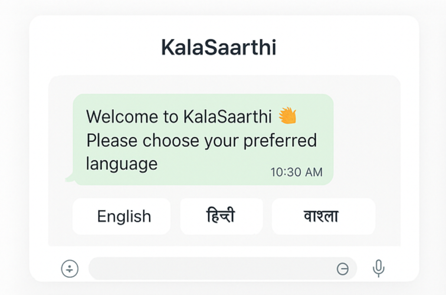
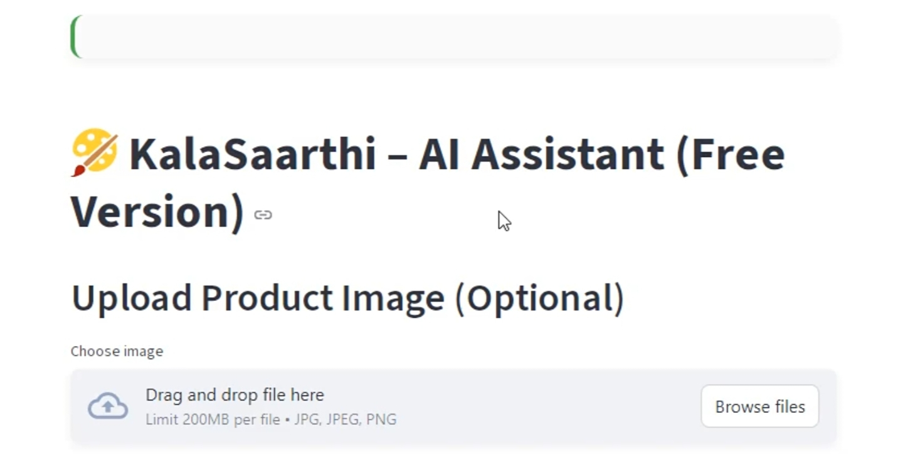
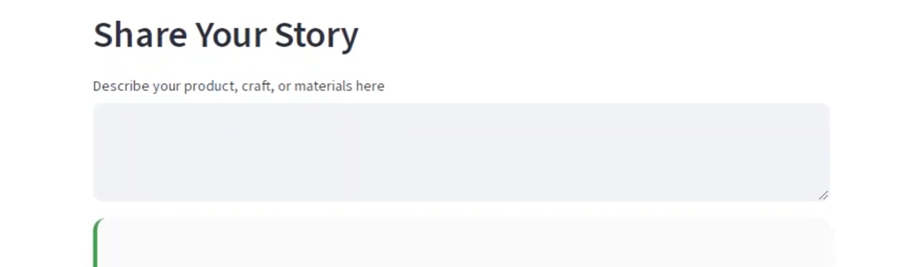
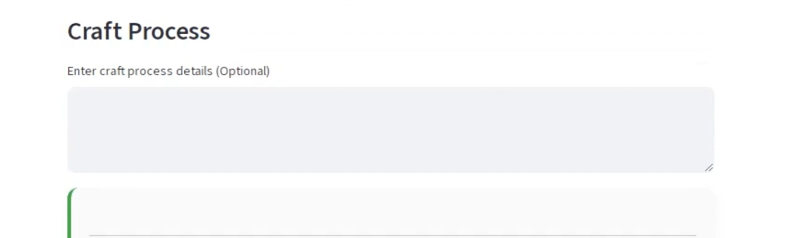
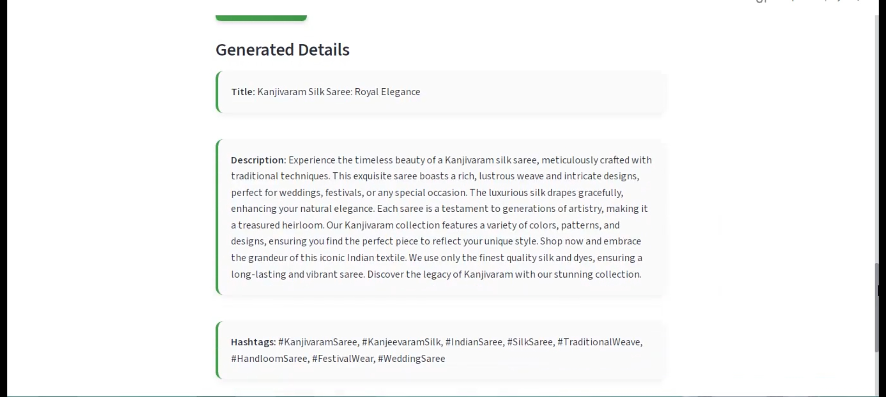
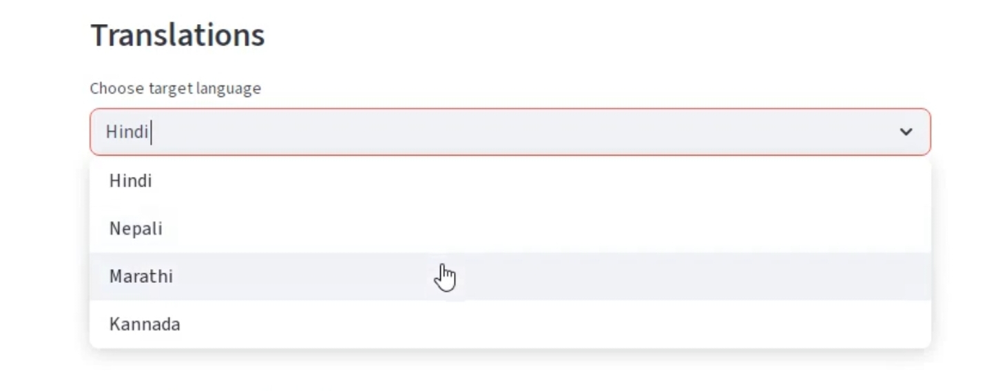
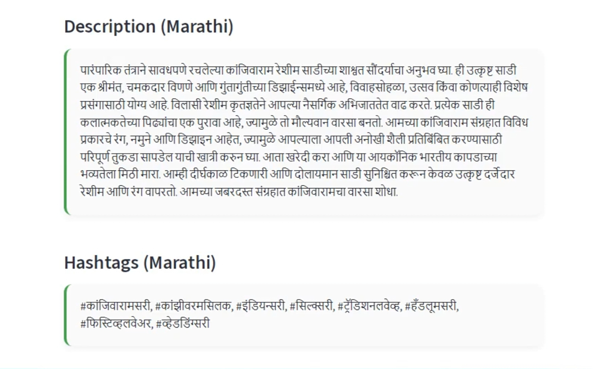
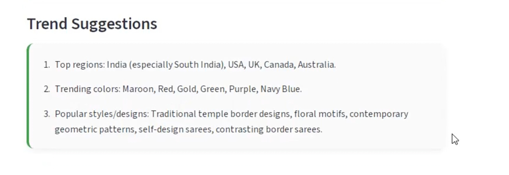
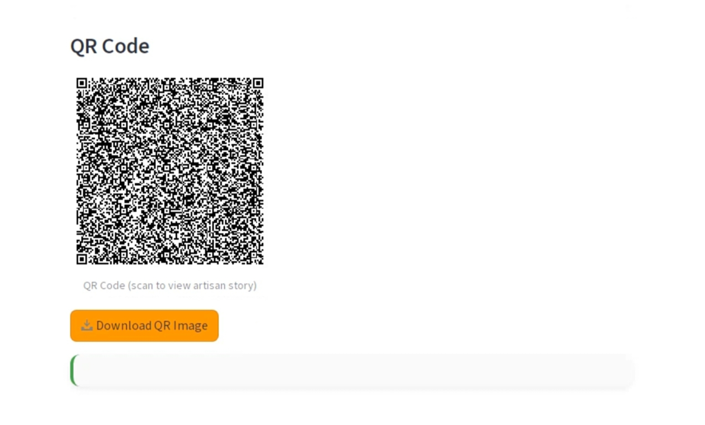
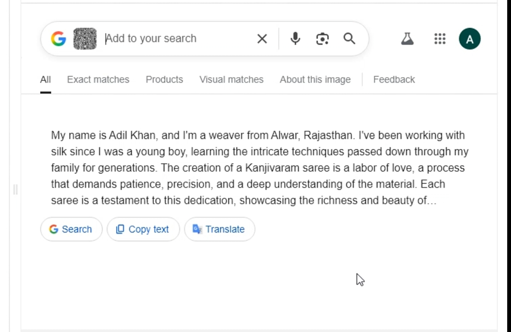

# 🌸 KalaSaarthi  
### *AI-Powered Marketplace Assistant for Local Artisans*  

💡 Empowering artisans to tell their stories, showcase crafts, and connect with global markets using AI.  

  
  
  

---
## 📖 About the Project  

**KalaSaarthi (कला सारथी)** is an AI-powered marketplace assistant that empowers Indian artisans by bridging traditional craftsmanship with modern digital selling.  

The platform helps artisans:  
- Showcase their craft with **AI-generated product stories**.  
- Improve product **photography with smart suggestions**.  
- Reach global audiences through **multilingual content & SEO optimization**.  
- Stay competitive with **AI-driven trend insights**.  

✨ The goal is to **preserve cultural heritage** while enabling artisans to thrive in the global e-commerce economy.

---

## ✨ Problem & Why it Matters?

India’s artisan community — from **handloom weavers in Varanasi** to **terracotta sculptors in West Bengal** — preserves centuries-old cultural heritage.  
Yet, artisans face systemic challenges in the digital era:

- **Digital Gap** 🖥️ – Many artisans lack the skills to market products online.  
- **Discoverability Issue** 🔍 – Their authentic work is overshadowed by mass-produced goods.  
- **Storytelling Barrier** 📖 – Artisans often cannot communicate the rich cultural history behind their crafts in a ways modern consumers.  
- **Market Limitation** 🛒 – Sales are restricted to local fairs or buyers, missing out on global e-commerce audiences.  

⚠️ Without intervention, traditional art forms risk **decline**, and artisans face **shrinking incomes**, despite global demand for authentic handmade goods.  

---

## 🌸 Our Solution – KalaSaarthi (कला सारथी)

KalaSaarthi is an **AI-powered marketplace assistant** that bridges **traditional craftsmanship** with **modern digital selling** through:  

1. **AI Storytelling Generator** 🖋️  
   Converts artisan interviews (audio/text) into compelling product descriptions, origin stories, and marketing content in **multiple languages** (English + local language).  

2. **Smart Product Photography Aid** 📸  
   Guides artisans to take better photos with their phones using AI prompts and real-time feedback on **lighting, angles, and backgrounds suggestions**.  

3. **Trend Mapper** 📊  
   Analyzes e-commerce trends and suggest **which colors, styles, and product variations** are in demand globally.  

4. **Marketplace Optimizer** 🔎  
   Generates **SEO-friendly titles, hashtags, and categroy tags** for platforms like Etsy, Amazon, and Instagram.  

5. **Automated Multilingual Content** 🌍  
   Creates **translated, culturally relevant posts** for social media to help artisans reach global buyers.  

6. **Buyer-Story Connect** 🔗  
   Attaches a **QR code** to each product linking to a short video or text about the **artisan  & craft process story**,generated automatically from AI interviews.  

---

## 🎯 Impact

By combining AI with artisan heritage, KalaSaarthi helps:  
- ✨ Preserve cultural traditions through digital storytelling.  
- 🌍 Expand artisan reach from **local bazaars to global marketplaces**.  
- 📈 Increase income by aligning crafts with **real market trends**.  
- 🤝 Build buyer trust through transparent, authentic narratives.  
- 🚀 Empower artisans with **digital-first tools** to thrive in the modern economy.
---

## 🚀 Workflow (with screenshots)

### 1️⃣ Onboarding  
Artisan joins via **WhatsApp or Web App** and sets preferred language.  

| WhatsApp Mockup | Web App Mockup |
|-----------------|----------------|
|  |  |

---

### 2️⃣ Product Creation  

 ## 📸 App Screenshots

### 1️. Upload Product Image  
Artisans uploads a photo of the craft.  

  

---

### 2️. Enter Product Story  
A short product story or description is added.  

  

---

### 3️. Enter Artisan Details  
Artisan provides name, city, and introduction.  

---

### 4️. Enter Craft Process  
Craft creation process is described.  

  

---
### 4️. generate button  
Click on generate button to generate the product details. 

---
### 5️. Generate AI Output  
AI generates titles, descriptions, hashtags, artisan intro & craft process.  

  

---

### 6️. Translation (Optional)  
Description can be translated into Hindi (or other supported languages).  

  
 

---
### 7️. Trend Suggestions  
AI suggests trending colors, styles, and variations based on the product and target market location.  

### 7️. QR Code Generation  
Final introduction + process is encoded into a QR code for buyers.  

  
  

---

### 3️⃣ Publishing  
- Exports ready-to-upload content for **Instagram, Etsy, or Amazon**.  
- Generates **QR code linking to the artisan's story page**.  
 

---

### 4️⃣ Analytics & Learning  
- Monthly report: *"Your best-selling product style"*, *"Top keywords buyers used"*.  
- Micro-lessons: *"3 tips to package your product for overseas shipping"* 

---

## 🚀 Features at a Glance

| Feature | Description |
|---------|-------------|
| 🖼️ **Image Upload** | Upload product images for AI understanding |
| ✍️ **Product Story** | Auto-generate creative & emotional stories |
| 👤 **Artisan Details** | AI introduces artisans professionally |
| 🧵 **Craft Process** | Expand or refine craft-making details |
| 🌐 **Translation** | Convert descriptions into local languages  |
| 📊 **Trend Suggestions** | Get dynamic style/color/market insights |
| 🔗 **QR Code** | Share artisan & process details with a scan |
| 🎨 **Polished UI** | Clean, responsive design for mobile + desktop |

---

## 🛠️ Technical Details

### ⚡ Tech Stack (Google Cloud–First Approach)

Our solution is designed cloud-native, ensuring **scalability, reliability, and cost-effectiveness**.  

---

### 🎨 Frontend
- **Flutter**  
  - Android-first approach for artisans (mobile-friendly).  
  - PWA support for web users → no installation needed.  
- **WhatsApp Bot (via Twilio/Meta BSP)**  
  - Ultra-low-barrier adoption → artisans can interact via WhatsApp itself.  

✅ 

---

### 🤖 Backend & AI
- **Cloud Run (FastAPI/Node.js)**  
  - Lightweight, auto-scalable API endpoints for chat, product photo processing, and text generation.  
- **Vertex AI – Gemini 1.5 Pro/Flash**  
  - Generates product storytelling, professional descriptions, translations.  
  - Summarizes artisan interviews into structured, market-ready text.  
  - Analyzing global + local trends from e-commerce data (via API).  
- **Vertex AI Vision**  
  - Checks photo quality, suggests backgrounds.  
- **Vertex AI Search / RAG**  
  - Pulling **latest market trends** from curated sources.  
- **Speech-to-Text API**  
  - Converts artisan’s spoken inputs into structured text.  
- **Translation API**  
  - Provides multilingual content (Indian + global languages).  

✅ 

---

### 🗂️ Data & Storage
- **Firestore**  
  - Stores artisan profiles, product metadata.  
- **Cloud Storage**  
  - Manages images, audio files, and generated media (QR codes, videos).  
- **Cloud SQL (optional)**  
  - Marketplace analytics, structured queries.  

✅ 

---

### 🔐 Other GCP Services
- **Cloud Functions**  
  - Automates QR code generation & media processing.  
- **Cloud Scheduler + Pub/Sub**  
  - Pushes **weekly trend updates** to artisans automatically.  
- **Secret Manager**  
  - Keeps API keys safe.  
- **DLP API**  
  - Redacts personal/sensitive data before storage or processing.  

✅ 

---
## 📂 Project Structure  

📂 KalaSaarthi/  
 ┣ 📂 .streamlit/  
 ┃ ┗ 📄 config.toml                                    # Streamlit app settings (theme, layout, etc.)  

 ┣ 📂 .venv/  
 ┃ ┗ ...                                                                     # Virtual environment (not included in Git)  

 ┣ 📂 assets/  
 ┃ ┗ 📄 architecture.png                         # System diagrams, mockups, and static assets  

 ┣ 📂 modules/                                                  # Modular Python files for features  
 ┃ ┣ 📄 __init__.py                                               # Marks this folder as a Python package  
 ┃ ┣ 📄 speech_to_text_gcp.py            # Google Cloud Speech-to-Text integration  
 ┃ ┗ 📄 vision_feedback_gcp.py         # Vision AI feedback & photo quality checks  

 ┣ 📂 styles/  
 ┃ ┗ 📄 style.css                                             # Custom CSS for professional UI design  

 ┣ 📂 screenshots/  
 ┃ ┗ 📄 ui1.png → ui9.png                    # Workflow screenshots used in README  

 ┣ 📄 app.py                                                        # Main Streamlit application (UI + core logic)  
 ┣ 📄 gemini_fallback.py                         # Gemini AI fallback handling when credits are low  
 ┣ 📄 speech_to_text_main.py              # Entry point for audio → text processing  
 ┣ 📄 requirements.txt                              # Python dependencies list  
 ┗ 📄 README.md                                           # Project documentation

---

## ⚡ Quick Start

### Clone the repo
git clone https://github.com/username/kalasaarthi.git
cd kalasaarthi

### Install dependencies
pip install -r requirements.txt

### Run the app
streamlit run app.py

---

## 🔮 Future Roadmap (Advanced Features)

Our MVP focuses on artisan onboarding, AI-assisted content generation, and QR-based storytelling.  
The next phase will add advanced, market-ready capabilities:

### 🎥 Auto-Generated Marketing Videos  
- Convert uploaded product photos + artisan narration into short promotional videos.  
- AI auto-generates captions, background music, and subtitles in local languages.  

### 💰 AI-Assisted Pricing Recommendations  
- Dynamic pricing suggestions based on demand, market trends, and competitor analysis.  
- Ensures artisans can price competitively while maximizing profit margins.  

### 🌍 Direct Marketplace Integrations  
- Seamless integration with **Google Shopping, Amazon, Etsy APIs**.  
- Auto-upload product listings (titles, descriptions, hashtags, pricing) with one click.  

### 📚 Personalized Learning Modules  
- Micro-lessons: *“How to Sell Better Online”* delivered in local languages.  
- Lessons adapt to artisan progress & sales performance.  

### 🔗 Blockchain-Based Provenance Certificates  
- Each craft gets a **tamper-proof digital certificate of authenticity**.  
- Buyers can verify origin, artisan identity, and production details via QR scan.  

---

## 👤 Developer  

This project was **conceptualized, designed, and developed entirely solo** as part of the **Google Gen AI Hackathon 2025**.  

**Developer:** ADIL KHAN  
- 💡 Ideation & UX Design  
- 🧑‍💻 Full-stack Development (Frontend + Backend)  
- 🤖 AI/ML Integration with Google Cloud Vertex AI  
- 📝 Documentation & Presentation  

---

✨ Crafted with love for artisans, powered by AI. ✨

---